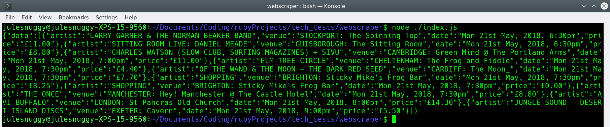

# WeGotTickets Webscraper

## Introduction
This is a simple webscraper which will extract data from the [WeGotTickets](http://www.wegottickets.com) website. It will return the first 10 results of the website's "General - Music" events, consisting of the following data:
1. Artist (which is sometimes an event name)
2. Venue (city and location)
3. Date (date and time)
4. Price (inclusive of all fees)

## Approach
Given the time constraints, a TDD approach was not taken, so "testing" was done via experimentation and gaining visibility by console logging.

Several node packages were experimented with before the `Puppeteer` package was selected. This was determined to be the simplest and most reliable. It runs a headless browser to simulate user interaction with the website and extracts data based upon the repetitive structure of HTML/CSS elements to create the list of events.

The approrpiate elements corresponding to the necessary data were found by exploring through the Console Log / Chrome Dev Tools.

Due to the inability for HTML to understand the `require` comamnd, this app runs in the Terminal.

## Screenshot

## Installation and Use
1. Unzip the files.
2. In Terminal, navigate to the directory where the project files have been extracted.
3. Install the node packages by running `npm install`.
4. From the project root directory, run `node ./index.js`. This will return a JSON string of the first page of results for "Music - General".
